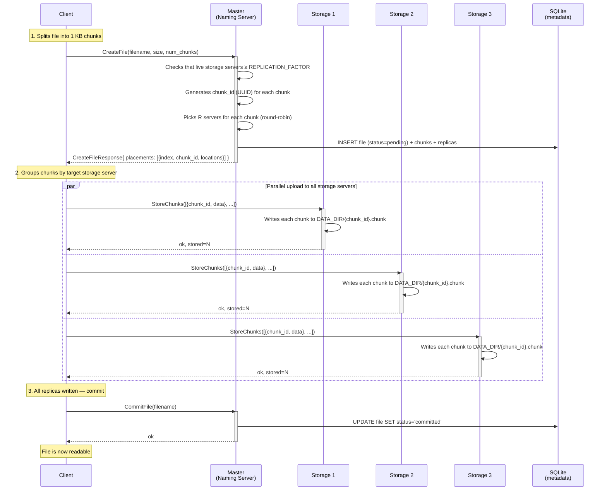
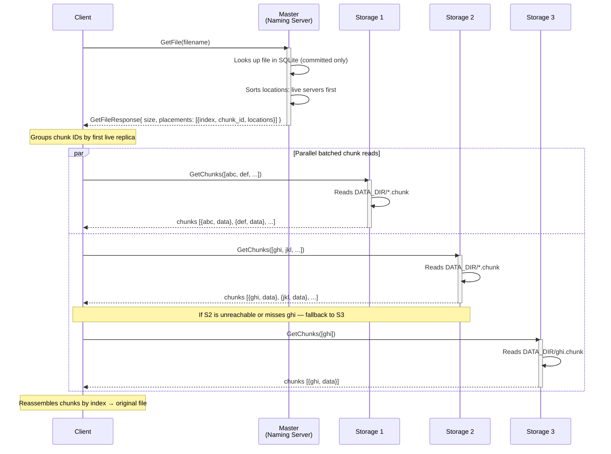
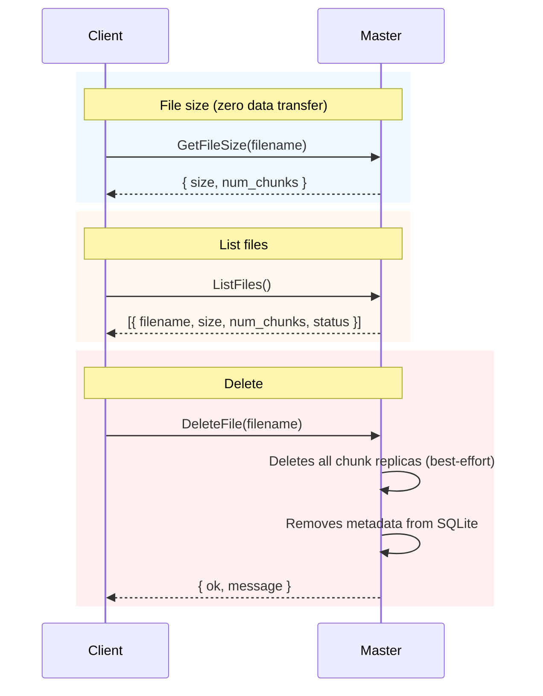

# Communication Flows

Diagrams of client ↔ master (naming server) and client ↔ chunkserver
(storage server) interactions for write and read operations.

---

## 1. Full write path (create)

The client first gets a **placement plan** from the master, then writes chunks
**directly** to the storage servers, and finally commits the file through the master.



### client→master details (CreateFile)

| RPC | Direction | Data |
| --- | --- | --- |
| `CreateFile` | Client → Master | `filename`, `size` (bytes), `num_chunks` |
| `CreateFileResponse` | Master → Client | `placements[]` — per chunk: `index`, `chunk_id` (UUID), `locations[]` (storage addresses) |

The master **never stores or transfers** chunk content — only addresses.

### client→chunkserver details (StoreChunks)

| RPC | Direction | Data |
| --- | --- | --- |
| `StoreChunks` | Client → Storage | `chunks[]` — list of `{chunk_id, data}` (batched up to 1024 chunks ≈ 1 MB) |
| `StoreChunksResponse` | Storage → Client | `ok`, `stored` (how many written) |

The client groups all chunks destined for the same storage server into a single
`StoreChunks` RPC and sends to all servers **in parallel**.

---

## 2. Full read path

The client requests chunk locations from the master, then reads chunk batches
**directly** from available storage servers.



### client→master details (GetFile)

| RPC | Direction | Data |
| --- | --- | --- |
| `GetFile` | Client → Master | `filename` |
| `GetFileResponse` | Master → Client | `size`, `placements[]` (sorted by `index`), live replicas listed first |

### client→chunkserver details (GetChunks)

| RPC | Direction | Data |
| --- | --- | --- |
| `GetChunks` | Client → Storage | `chunk_ids[]` (batched up to 1024 chunks ≈ 1 MB) |
| `GetChunksResponse` | Storage → Client | `chunks[]`, `missing_chunk_ids[]` |

The client groups pending chunks by the next replica address and uses returned
chunks immediately. If a server is unreachable or reports missing chunks, only
those missing chunks are retried against the next replica.

---

## 3. Other client→master RPCs



### All client↔master RPCs summary

| RPC | Client → Master | Master → Client | Purpose |
| --- | --- | --- | --- |
| `CreateFile` | filename, size, num_chunks | placement plan (chunk_id + locations) | Reserves metadata |
| `CommitFile` | filename | ok | Makes the file readable |
| `GetFile` | filename | size + placement plan | Returns chunk locations for reads |
| `GetFileSize` | filename | size, num_chunks | Size from metadata (0 bytes of data) |
| `ListFiles` | — | [filename, size, status, …] | Lists all files |
| `DeleteFile` | filename | ok + message | Deletes replicas and metadata |

### All client↔chunkserver RPCs summary

| RPC | Client → Storage | Storage → Client | Purpose |
| --- | --- | --- | --- |
| `StoreChunks` | [{chunk_id, data}, …] | ok, stored=N | Batch chunk writes |
| `GetChunks` | [chunk_id, …] | [{chunk_id, data}, …] | Batch chunk reads |
| `GetChunk` | chunk_id | data | Single chunk read / compatibility |

---

## 4. Key principle: separation of metadata and data

```
                    ┌──────────────────────┐
                    │       Master         │
                    │   (Naming Server)    │
                    │                      │
                    │  Metadata (SQLite):  │
                    │  • file → [chunks]   │
                    │  • chunk → [servers] │
                    │  • liveness          │
                    └──────┬───────────────┘
                           │
              ┌────────────┼────────────┐
              │ metadata   │ metadata   │ metadata
              │ (placement │ (locations │ (commit,
              │  plan)     │  for read) │  delete)
              │            │            │
           ┌──▼────────────▼────────────▼──┐
           │            Client             │
           │  • splits/reassembles chunks  │
           │  • knows placement from master│
           │  • reads/writes chunks direct │
           └──┬─────────┬─────────┬────────┘
              │ data    │ data    │ data
              │ (gRPC)  │ (gRPC)  │ (gRPC)
        ┌─────▼──┐ ┌───▼────┐ ┌▼───────┐
        │Storage1│ │Storage2│ │Storage3│
        │ .chunk │ │ .chunk │ │ .chunk │
        │ files  │ │ files  │ │ files  │
        └────────┘ └────────┘ └────────┘
```

The master **never participates in data transfer** — the client talks to it only
for metadata (placement/locations). All chunk content is transferred directly
between the client and storage servers. This is the core architectural idea of GFS:
**separation of the metadata path from the data path**.
